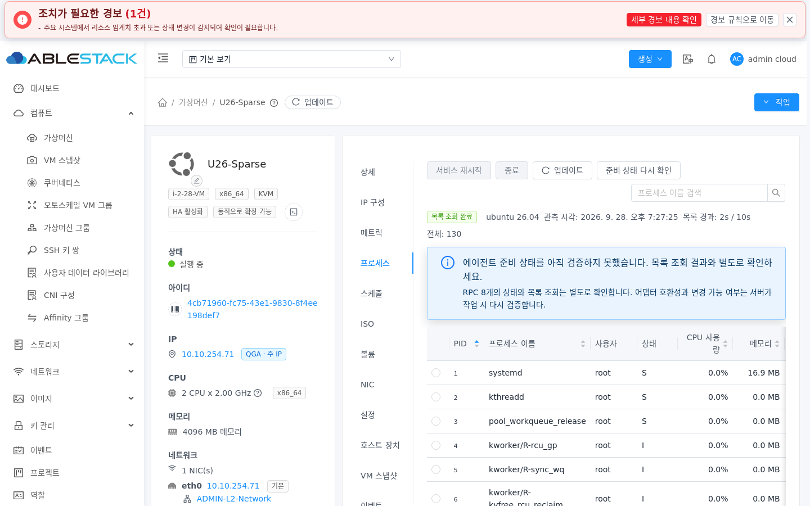
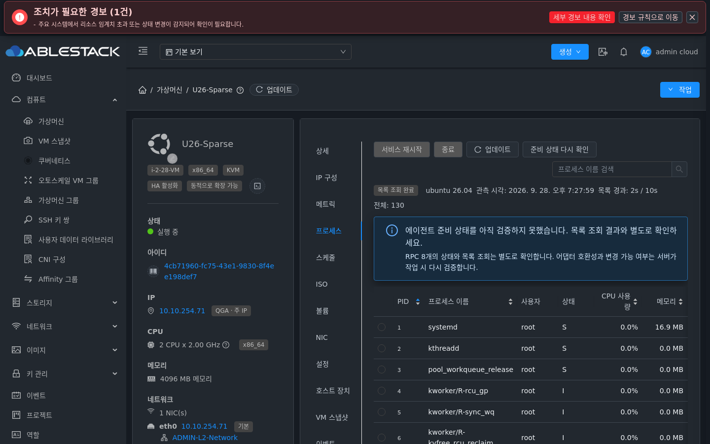
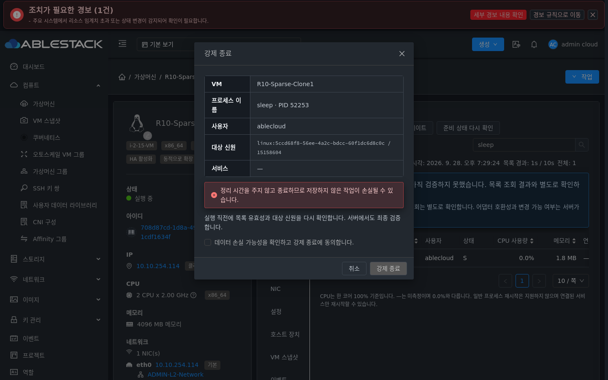
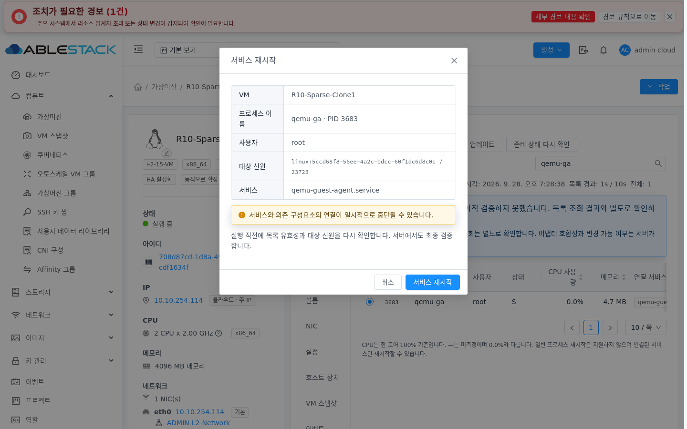
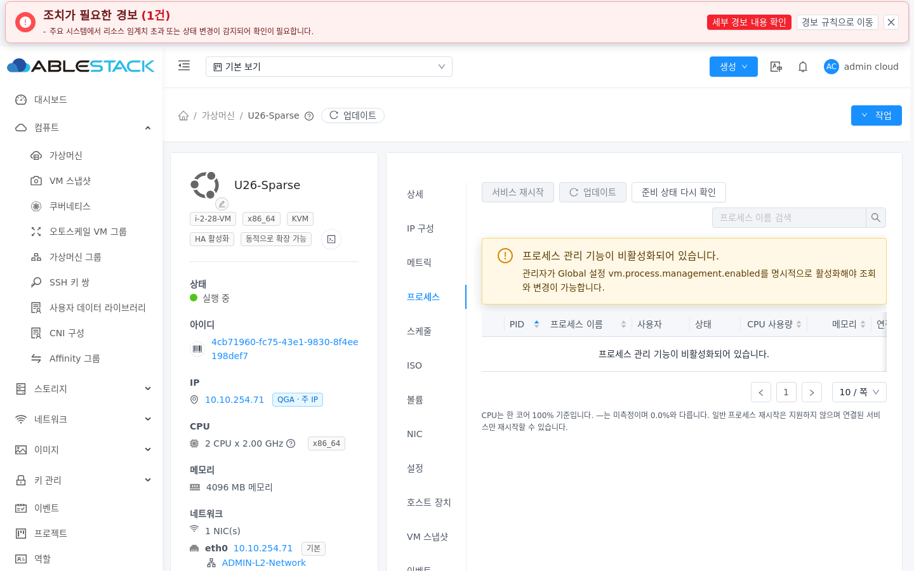

<!--
Licensed to the Apache Software Foundation (ASF) under one
or more contributor license agreements.  See the NOTICE file
distributed with this work for additional information
regarding copyright ownership.  The ASF licenses this file
to you under the Apache License, Version 2.0 (the
"License"); you may not use this file except in compliance
with the License.  You may obtain a copy of the License at

  http://www.apache.org/licenses/LICENSE-2.0

Unless required by applicable law or agreed to in writing,
software distributed under the License is distributed on an
"AS IS" BASIS, WITHOUT WARRANTIES OR CONDITIONS OF ANY
KIND, either express or implied.  See the License for the
specific language governing permissions and limitations
under the License.
 -->

# VM 프로세스 탭 실환경 UI 검증 (#1176)

2026-09-28, 10.10.31.10 관리 UI의 `/usr/share/cloudstack-management/webapp`에 정적 자산만 배포해 검증했다. 배포 전후 `WEB-INF`가 존재하고 `/client/`는 HTTP 200, `mold`는 active였다. 테스트 후 `vm.process.management.enabled=false`로 복원했다.

- Ubuntu 26.04 (`i-2-28-VM`), Rocky Linux 10.2 (`i-2-15-VM`), Windows (`i-2-27-VM`)의 실제 프로세스 목록을 일반/다크 모드에서 조회했다. 각 화면의 첫 10개 행과 CPU 사용량 열을 확인했고 브라우저 예외나 실패한 조회 API 응답은 없었다.
- VM 탭 순서는 `상세 → IP 구성 → 메트릭 → 프로세스`였다. 같은 VM의 볼륨, NIC, VM 스냅샷 탭과 툴바, 표, 페이지 배치 및 일반/다크 색상을 비교했다.
- Global 설정이 꺼진 상태에서 안내 문구와 조회/변경 비활성화를 확인했다. 서버의 431 응답 본문을 해석해 원시 HTTP 오류를 화면에 노출하지 않는다.
- Rocky VM에서 임시 `sleep` 프로세스를 선택해 종료 확인 대화상자와 비동기 결과를 검증했다. 서버는 실행 전 `STALE_IDENTITY`, `effect=NOT_STARTED`로 거부했고 UI는 성공으로 표시하지 않고 `FAILED`를 표시했다. 실제 종료 성공은 **미검증**이며 qemu Q5(#64)의 실행 경로 보완이 필요하다. 테스트 프로세스는 정리했다.
- 다크 모드의 강제 종료 대화상자에서 대상 정보, 영향 경고, 명시적 동의 확인란, 동의 전 확인 버튼 비활성화를 확인했다. 변경 명령은 보내지 않았다.
- 서비스가 연결된 행을 선택하면 첫 파란 버튼으로 서비스 재시작 확인창이 열리고 서비스 이름과 영향 경고가 표시되는 것을 확인했다. 보호 대상 서비스에는 변경 명령을 보내지 않았다.

